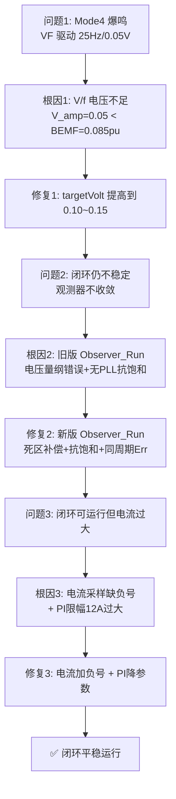

# FOC 闭环调试全记录 — 从爆鸣到平稳运行

> 项目: FOC_ST_V2_0611 | MCU: STM32G474 | 日期: 2026-07-05
> 最终状态: ✅ 闭环可运行，电流已控制

---

## 0. 问题演进时间线



---

## 1. 问题一：Mode 4 (VF+观测器预热) 爆鸣

### 现象
- Mode 4, targetHz=25Hz, targetVolt=0.05
- 电机剧烈爆鸣，Vofa 数据 Id 从 +5.77A 摆到 -6.22A

### 根因：V/f 电压严重不足

```
V_amp @ 25Hz  = 0.050 pu
反电动势 @ 25Hz = 2π × 25 × 0.00752 = 1.18V
V_amp 实际电压  = 0.05 × (24V/√3) = 0.69V

V_amp / 反电动势 = 0.69 / 1.18 = 0.59  ← 电压只有反电动势的 59%！
```

电机无法克服自身反电动势 → 周期性失步 → 电流剧烈振荡 → 爆鸣。

### 修复
- `targetVolt` 从 0.05 提高到 **0.10~0.15**（V/f ≈ 0.0045 × Hz）

---

## 2. 问题二：切闭环 (Mode 2) 后仍不稳定

### 根因：旧版 `Observer_Run` 有两个致命缺陷

| 缺陷 | 旧版 | 影响 |
|------|------|------|
| 电压量纲错误 | `SVPWM_dq.Ualpha`（0~1 pu）直接当伏特积分 | 磁链估算完全无物理意义 |
| 无 PLL 抗饱和 | 积分项 `PLL_Interg` 无限增长 | 误差大时积分飞掉，角度永远回不来 |

### 修复：集成新版 `Observer_Run`

- 死区补偿 `Deadtime_Comp_ab()`：命令电压 → 真实电压(V)
- PLL 积分抗饱和：`Limit_Sat` 限制 ±0.157 rad/周期
- 磁链误差同周期补偿：消除一周期延迟
- PLL 增益自动 ramp 恢复

---

## 3. 问题三：闭环可运行但电流过大

### 现象
- Mode 2 闭环能转了，但 Iq 电流持续偏高（>5A）
- 电机发热严重

### 根因分析

#### 根因 3.1：电流采样方向反了 🔴

```c
// 旧版 (SING) 有负号:
PhaseU_Curr = -(ADC - Offset) * Ratio;

// 新版 (Foc_Adc_Sample) 缺负号:
PhaseU_Curr =  (ADC - Offset) * Ratio;  // ← 方向反了！
```

电流方向反了 → Clarke/Park 符号错 → Id/Iq 算反 → 电流环正反馈 → 电流失控。

**修复**：三相电流 + 母线电流全部加回负号（`ADC_Sample.c`）

#### 根因 3.2：速度环 Iq 限幅 12A 过大 🔴

`pi_spd.Umax = 12.0f`，注释写的是 "限制 5A" 但代码是 12A。

任何显著速度误差都会瞬间将 Iq 给定拉到 12A。

**修复**：降到 3.0A（`PI_Cale.c`）

#### 根因 3.3：电流环 PI 限幅无效 🟡

`pi_id.Umax = 12.0f` / `pi_iq.Umax = 12.0f` 是 per-unit 值，但最大有效电压只有 1.0 pu。限幅形同虚设。

**修复**：降到 1.0 pu（`PI_Cale.c`）

#### 根因 3.4：MOTOR_LS = 20µH 高度可疑 🟡

20µH 是极低的电感值。若真实值差 10 倍，观测器和电流环计算都会严重偏离。

**待验证**：用 LCR 表实测。

---

## 4. 📊 Vofa 监控通道

> 代码位置: `taskManager/taskManager.c` → `HFPeriod_RUN()`

| 通道 | 变量 | 含义 | **正常值** | **异常表现** |
|------|------|------|-----------|-------------|
| CH1 | `motor.CurrentHz` | 当前电频率 (Hz) | 稳定跟踪目标 | 大幅跳动 → 失步 |
| CH2 | `PARK_PCurr.Ds` | d 轴电流 Id (A) | **≈ 0** | 偏离 0 → 角度/参数错 |
| CH3 | `PARK_PCurr.Qs` | q 轴电流 Iq (A) | 稳定，正比于负载 | 剧烈波动 → 电流环震荡 |
| CH4 | `motor.V_d` | d 轴电压 (pu) | ≈ 0 | 异常偏大 → 角度误差 |
| CH5 | `motor.V_q` | q 轴电压 (pu) | 正比于转速 | 饱和(≈1.0) → 电压不足 |
| CH6 | `BUS_Voltage` | 母线电压 (V) | ≈ 24V 稳定 | 大幅跌落 → 电源不足 |

### Vofa 配置
- 协议: JustFloat
- 通道数: 6
- 帧尾: `00 00 80 7F`
- 帧率: ~1kHz

---

## 5. 📊 调参流程

### 阶段 A：Mode 3 (VF) 验证基础

```
1. targetHz=10Hz, targetVolt=0.06
2. Vofa 观察 CH2(Id)/CH3(Iq) — 电流应正弦
3. 逐步提高 targetHz 和 targetVolt (V/f≈0.0045)
```

### 阶段 B：Mode 4 预热

```
1. 切到 Mode 4
2. CH1(CurrentHz) 应平滑斜坡上升
3. CH2(Id) 应接近 0
4. CH3(Iq) 应稳定不振荡
5. LCD 看 "Psi" 值是否涨到 ~0.0075
```

### 阶段 C：Mode 2 闭环（关键）

```
1. 满足预热条件后切 Mode 2
2. 观察 CH3(Iq):
   - 切换瞬间 < 3A ✅
   - 切换瞬间 > 5A → 降速度环 Kp/Ki
   - Iq 持续振荡 → 降电流环 Kp
3. 观察 CH2(Id):
   - 应稳定在 0 ± 1A
   - 大幅偏离 → 角度有误差，检查 PLL
4. 观察 CH5(Vq):
   - 应 < 0.8 pu（有余量）
   - 接近 1.0 → 电压不足，提高 targetVolt
```

---

## 6. 🎯 已应用参数（2026-07-05）

`PI_Cale.c` → `PI_Init()` 当前值：

| 环 | Kp | Ki | Umax | Umin |
|----|-----|------|------|------|
| 速度环 `pi_spd` | 0.005 | 0.00005 | **3.0 A** | -3.0 A |
| d轴电流 `pi_id` | 0.005 | 0.000005 | **1.0 pu** | -1.0 pu |
| q轴电流 `pi_iq` | 0.005 | 0.000005 | **1.0 pu** | -1.0 pu |

---

## 7. ⚠️ 关键验证项

| 验证项 | 方法 | 期望值 |
|--------|------|--------|
| MOTOR_LS | LCR 表 1kHz 测两相 ÷ 2 | 应为 0.1~10 mH 量级 |
| MOTOR_RS | 万用表测两相电阻 ÷ 2 | 应与代码一致 |
| 电流零点校准 | 上电自动执行 | Offset 值应稳定 |
| VF 电流波形 | Vofa CH2/CH3 | 正弦，无削波 |
| 闭环 Iq 稳态 | Vofa CH3 | < 3A，不振荡 |

---

## 8. 修改历史

| 日期 | 文件 | 修改 |
|------|------|------|
| 2026-07-05 | `ADC_Sample.c` | 三相电流+母线电流加负号 |
| 2026-07-05 | `flux.c` | 集成新版 `Observer_Run`（死区补偿+抗饱和） |
| 2026-07-05 | `PI_Cale.c` | 降 PI 增益 + 限幅（12A→3A, 12pu→1pu） |
| 2026-07-05 | `taskManager.c` | Vofa 通道改为正常运行监控 |
| 2026-07-05 | — | 诊断 V/f 不足 → targetVolt ≥ 0.10 |
