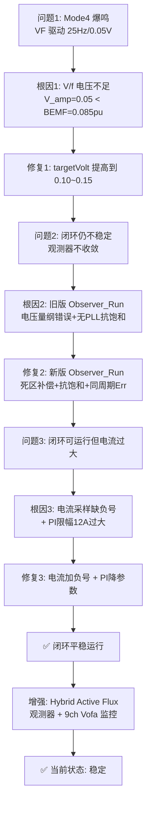

# FOC 闭环调试全记录 — 从爆鸣到平稳运行

> 项目: FOC_ST_V2_0611 | MCU: STM32G474 | 更新日期: 2026-07-08
> 最终状态: ✅ 闭环可运行，电流已控制 | 观测器支持 Hybrid / 电压型双模式

---

## 0. 问题演进时间线



---

## 1. 问题一：Mode 4 (VF+观测器预热) 爆鸣

### 现象
- Mode 4, targetHz=25Hz, targetVolt=0.05
- 电机剧烈爆鸣，Vofa 数据 Id 从 +5.77A 摆到 -6.22A

### 根因：V/f 电压严重不足

```
V_amp @ 25Hz  = 0.050 pu
反电动势 @ 25Hz = 2π × 25 × 0.00752 = 1.18V
V_amp 实际电压  = 0.05 × (24V/√3) = 0.69V

V_amp / 反电动势 = 0.69 / 1.18 = 0.59  ← 电压只有反电动势的 59%！
```

电机无法克服自身反电动势 → 周期性失步 → 电流剧烈振荡 → 爆鸣。

### 修复
- `targetVolt` 从 0.05 提高到 **0.10~0.15**（V/f ≈ 0.0045 × Hz）

---

## 2. 问题二：切闭环 (Mode 2) 后仍不稳定

### 根因：旧版 `Observer_Run` 有两个致命缺陷

| 缺陷 | 旧版 | 影响 |
|------|------|------|
| 电压量纲错误 | `SVPWM_dq.Ualpha`（0~1 pu）直接当伏特积分 | 磁链估算完全无物理意义 |
| 无 PLL 抗饱和 | 积分项 `PLL_Interg` 无限增长 | 误差大时积分飞掉，角度永远回不来 |

### 修复：集成新版 `Observer_Run`

- 死区补偿 `Deadtime_Comp_ab()`：命令电压 → 真实电压(V)
- PLL 积分抗饱和：`Limit_Sat` 限制 ±0.157 rad/周期
- 磁链误差同周期补偿：消除一周期延迟
- PLL 增益自动 ramp 恢复
- **新增 Hybrid Active Flux 模式** (`OBS_HYBRID_ACTIVE_FLUX`): 按二阶系统带宽设计 PLL 参数

---

## 3. 问题三：闭环可运行但电流过大

### 现象
- Mode 2 闭环能转了，但 Iq 电流持续偏高（>5A）
- 电机发热严重

### 根因分析

#### 根因 3.1：电流采样方向反了 🔴

```c
// 旧版 (SING) 有负号:
PhaseU_Curr = -(ADC - Offset) * Ratio;

// 新版 (Foc_Adc_Sample) 缺负号:
PhaseU_Curr =  (ADC - Offset) * Ratio;  // ← 方向反了！
```

**修复**：三相电流 + 母线电流全部加回负号（`ADC_Sample.c`）

#### 根因 3.2：速度环 Iq 限幅 12A 过大 🔴

`pi_spd.Umax = 12.0f`，注释写的是 "限制 5A" 但代码是 12A。

**修复**：降到 3.0A（`PI_Cale.c`）

#### 根因 3.3：电流环 PI 限幅无效 🟡

`pi_id.Umax = 12.0f` / `pi_iq.Umax = 12.0f` 是 per-unit 值，但最大有效电压只有 1.0 pu。

**修复**：降到 1.0 pu（`PI_Cale.c`）

#### 根因 3.4：MOTOR_LS = 20µH 高度可疑 🟡

20µH 是极低的电感值。若真实值差 10 倍，观测器和电流环计算都会严重偏离。

**待验证**：用 LCR 表实测。

---

## 4. 问题四：Mode 2 切换后电机颤动 🔴

> 发现日期: 2026-07-08 | 状态: 🔍 分析中

### 现象
- Mode 4 预热完成后切 Mode 2（无感闭环）
- 电机开始**颤动/抖动**，而非平稳旋转
- 不是之前的爆鸣，而是高频小幅振动

### 疑点分析

#### 疑点 1：切 Mode 2 时未插入零矢量过渡 🟡

当前 Mode 4 → Mode 2 切换是**瞬时硬切换**：

```c
// motorControl.c — Mode 4 最后输出由 VF_Control_Run() 控制 PWM
// 下一个 PWM 周期直接切到 Mode 2:
case 2:
    Angel_Get();      // PLL 角度
    UVW_Axis_DQ();    // Clarke+Park → Id/Iq
    Speed_FOC();      // 速度环 PI → Iq_ref
    Idq_FOC();        // 电流环 PI → Vd/Vq
    FOC_Svpwm_dq();   // iPark+SVPWM → PWM 更新
```

**问题**: VF 输出的 `Vα/Vβ` 和 FOC 电流环计算的 `Vα/Vβ` 在切换瞬间**不连续**。电流环 PI 积分器从 0 起步，第一个周期的 Vd/Vq 可能很小甚至为零 → SVPWM 输出接近零矢量 → 电机瞬间失力 → 颤动。

**验证方法**: Vofa 观察 CH4(Vd)/CH5(Vq) 在切换瞬间的波形。如果 Vq 从 VF 的正常值（如 0.1~0.3 pu）骤降到接近 0，说明电压不连续。

**候选修复**:
- 切换前预加载电流环 PI 积分器：
  ```c
  // 进入 Mode 2 时（mode_just_entered），用 VF 当前的 V_amp 反推 Iq_ref
  pi_iq.i1 = motor.V_amp * 0.5f;   // 预加载积分项
  pi_iq.Out = motor.V_amp;         // 预加载输出
  ```
- 或者在 Mode 4 的最后几个周期逐渐将 VF 电压收敛到 0 再切

---

#### 疑点 2：速度环斜坡未同步 → 力矩指令跳变 🔴

进入 Mode 2 时 `Speed_FOC()` 立即运行：

```c
// Foc.c → Speed_FOC()
pi_spd.Ref = SpeedRpm_GXieLv.XieLv_Y;   // 速度给定（斜坡输出）
pi_spd.Fbk = motor.SpeedRPM;             // 速度反馈
```

**关键问题**: `SpeedRpm_GXieLv.XieLv_X`（斜坡目标）在上电初始化后**从未被 Mode 4 更新**。进入 Mode 2 时：
- 如果 `XieLv_X` 还是 0（初始值）→ 斜坡输出为 0 → `pi_spd.Ref = 0`
- `motor.SpeedRPM` 可能是 100+ RPM（Mode 4 中电机实际在转）
- **速度误差 = 0 − 100 = −100 RPM** → 速度环 PI 饱和输出 −3A → 突然大幅负转矩 → 颤动！

**验证方法**: 在 KEY3/KEY4 中 Mode 2 下会设 `SpeedRpm_GXieLv.XieLv_X = motor.TargetHz * 60 / (POLES/2)`，但这是按键操作后才触发。如果在按 KEY3/KEY4 **之前**就切入了 Mode 2，`XieLv_X` 可能是旧值。

**修复**: 在进入 Mode 2 时同步速度斜坡：
```c
if (mode_just_entered) {
    SpeedRpm_GXieLv.XieLv_X = motor.TargetHz * 60.0f / (MOTOR_POLES / 2.0f);
    SpeedRpm_GXieLv.XieLv_Y = motor.SpeedRPM;  // 斜坡从当前速度起步
}
```

---

#### 疑点 3：无感 FOC 是否需要"力矩闭环"？

**结论：需要，且代码已有。**

无感 FOC 与有感 FOC 的唯一区别是**角度来源**（观测器 vs 传感器）。电流内环（力矩闭环）结构完全相同：

```
速度环 (Hz→Iq)  →  电流环 (Iq→Vq)  →  SVPWM  →  电机
              ↑                ↑
          SpeedRPM          Iq (Park)
```

当前 Mode 2 链路 `Speed_FOC() → Idq_FOC() → FOC_Svpwm_dq()` **已经是完整的力矩闭环**。

但如果**疑点 2** 导致速度环给定错误，力矩环即使正常工作也会输出错误的 Iq 指令 → 表现上像是"缺力矩环"。

---

#### 疑点 4：PLL 角度在切换瞬间跳动

Mode 4 中 `Foc_observer.PLL_Interg = pll_step`（每周期强制覆盖为 VF 频率），但 Mode 2 中 PLL 完全自由运行。切换瞬间 `PLL_Interg` 从强制值变为自由积分值 → 可能有微小跳变 → 角度跳 → Park 变换瞬间偏差 → dq 电流计算错误 → 颤动。

**修复**: 已在 Mode 4 中每周期将 PLL_Interg 设为 `pll_step`（前馈），切换时应连续。但如果 VF 频率和 PLL 估算频率有微小偏差，累积的角度误差可能在切换后暴露。

---

### 调试步骤

```
1. Vofa 同时监控 CH4(Vd)/CH5(Vq)/CH3(Iq)，从 Mode 4 切到 Mode 2
2. 观察:
   ┌─ CH5(Vq): 切换瞬间是否有骤降/骤升？
   │  骤降 → 疑点 1（电压不连续）
   ├─ CH3(Iq): 切换瞬间是否有大幅跳变（>3A）？
   │  跳变 → 疑点 2（速度环斜坡未同步）
   ├─ CH2(Id): 切换后是否偏离 0？
   │  偏离 → 疑点 4（PLL 角度偏差）
   └─ CH7/8/9: 三相电流是否正弦？
       畸变 → 角度或电压问题
3. 分别验证:
   a. 在进入 Mode 2 前先按 KEY3 一次（触发 XieLv_X 同步），再切 → 颤动是否消失？
   b. 在 Mode 2 中降低 pi_spd.Kp 到 0.001 → 颤动是否减轻？
   c. 在 Mode 4 中提高 TargetHz 到 40Hz（增强反电动势 SNR）再切 → 颤动是否消失？
```

---

### 快速修复尝试（按优先级）

| # | 修复 | 修改位置 | 预期效果 |
|---|------|---------|---------|
| 1 | Mode 2 进入时同步 `SpeedRpm_GXieLv` | `motorControl.c` case 2 | 消除速度环初始冲击 |
| 2 | Mode 2 进入时预加载 `pi_iq.i1` / `pi_iq.Out` | `motorControl.c` case 2 | 电压连续过渡 |
| 3 | Mode 4→2 之间插入 1 周期零矢量 | `motorControl.c` | 给电流环一个干净的起点 |
| 4 | 降低速度环 Kp (0.005→0.001) | `PI_Cale.c` | 减小转矩指令突变幅度 |

> 代码位置: `taskManager/taskManager.c` → `HFPeriod_RUN()`

| 通道 | 变量 | 含义 | **正常值** | **异常表现** |
|------|------|------|-----------|-------------|
| CH1 | `motor.CurrentHz` | 当前电频率 (Hz) | 稳定跟踪目标 | 大幅跳动 → 失步 |
| CH2 | `PARK_PCurr.Ds` | d 轴电流 Id (A) | **≈ 0** | 偏离 0 → 角度/参数错 |
| CH3 | `PARK_PCurr.Qs` | q 轴电流 Iq (A) | 稳定，正比于负载 | 剧烈波动 → 电流环震荡 |
| CH4 | `motor.V_d` | d 轴电压 (pu) | ≈ 0 | 异常偏大 → 角度误差 |
| CH5 | `motor.V_q` | q 轴电压 (pu) | 正比于转速 | 饱和(≈1.0) → 电压不足 |
| CH6 | `BUS_Voltage` | 母线电压 (V) | ≈ 24V 稳定 | 大幅跌落 → 电源不足 |
| CH7 | `PhaseU_Curr` | U 相电流 (A) | 正弦 | 畸变 → SVPWM/硬件问题 |
| CH8 | `PhaseV_Curr` | V 相电流 (A) | 正弦 | 同上 |
| CH9 | `PhaseW_Curr` | W 相电流 (A) | 正弦 | 同上 |

### Vofa 配置
- 协议: JustFloat
- 通道数: 9
- 帧尾: `00 00 80 7F`
- 帧率: ~1kHz

---

## 5. 📊 调参流程

### 阶段 A：Mode 3 (VF) 验证基础

```
1. targetHz=10Hz, targetVolt=0.06
2. Vofa 观察 CH7/CH8/CH9 (三相电流) — 电流应正弦
3. 逐步提高 targetHz 和 targetVolt (V/f≈0.0045)
```

### 阶段 B：Mode 4 预热

```
1. 切到 Mode 4
2. CH1(CurrentHz) 应平滑斜坡上升
3. CH2(Id) 应接近 0
4. CH3(Iq) 应稳定不振荡
5. LCD 看 "Psi" 值是否涨到 ~0.0075
```

### 阶段 C：Mode 2 闭环（关键）

```
1. 满足预热条件后切 Mode 2
2. 观察 CH3(Iq):
   - 切换瞬间 < 3A ✅
   - 切换瞬间 > 5A → 降速度环 Kp/Ki
   - Iq 持续振荡 → 降电流环 Kp
3. 观察 CH2(Id):
   - 应稳定在 0 ± 1A
   - 大幅偏离 → 角度有误差，检查 PLL
4. 观察 CH5(Vq):
   - 应 < 0.8 pu（有余量）
   - 接近 1.0 → 电压不足，提高 targetVolt
```

---

## 6. 🎯 已应用参数（2026-07-08）

`PI_Cale.c` → `PI_Init()` 当前值：

| 环 | Kp | Ki | Umax | Umin |
|----|-----|------|------|------|
| 速度环 `pi_spd` | 0.005 | 0.00005 | **3.0 A** | -3.0 A |
| d轴电流 `pi_id` | 0.005 | 0.000005 | **1.0 pu** | -1.0 pu |
| q轴电流 `pi_iq` | 0.005 | 0.000005 | **1.0 pu** | -1.0 pu |

观测器参数 (`Flux/src/flux.c` → `Flux_Observer_Init()`):

| 参数 | 电压型 (默认) | Hybrid Active Flux |
|------|-------------|-------------------|
| PLL_kp | 20.0 | 自动计算 (2·ω_pll) |
| PLL_ki | 10.0 | 自动计算 (ω_pll²·Ts) |
| Gain | 5000.0 | 5000.0 |
| PLL_BW_Hz | — | `HYBRID_PLL_BW_HZ` (默认 50Hz) |

---

## 7. ⚠️ 关键验证项

| 验证项 | 方法 | 期望值 |
|--------|------|--------|
| MOTOR_LS | LCR 表 1kHz 测两相 ÷ 2 | 应为 0.1~10 mH 量级 |
| MOTOR_RS | 万用表测两相电阻 ÷ 2 | 应与代码一致 |
| 电流零点校准 | 上电自动执行 | Offset 值应稳定 |
| VF 电流波形 | Vofa CH7/8/9 | 正弦，无削波 |
| 闭环 Iq 稳态 | Vofa CH3 | < 3A，不振荡 |

---

## 8. 修改历史

| 日期 | 文件 | 修改 |
|------|------|------|
| 2026-07-05 | `ADC_Sample.c` | 三相电流+母线电流加负号 |
| 2026-07-05 | `flux.c` | 集成新版 `Observer_Run`（死区补偿+抗饱和） |
| 2026-07-05 | `PI_Cale.c` | 降 PI 增益 + 限幅（12A→3A, 12pu→1pu） |
| 2026-07-05 | `taskManager.c` | Vofa 通道改为正常运行监控 |
| 2026-07-08 | `flux.c/h` | 新增 Hybrid Active Flux 观测器模式 |
| 2026-07-08 | `taskManager.c` | Vofa 6ch→9ch，新增三相电流原始值 |
| 2026-07-08 | `Foc.h` | 注释乱码清理 + 冗余字段移除 |
| 2026-07-05 | — | 诊断 V/f 不足 → targetVolt ≥ 0.10 |
